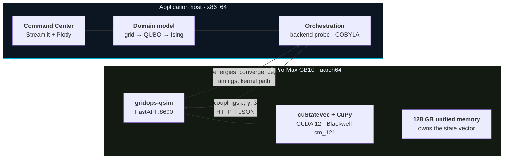
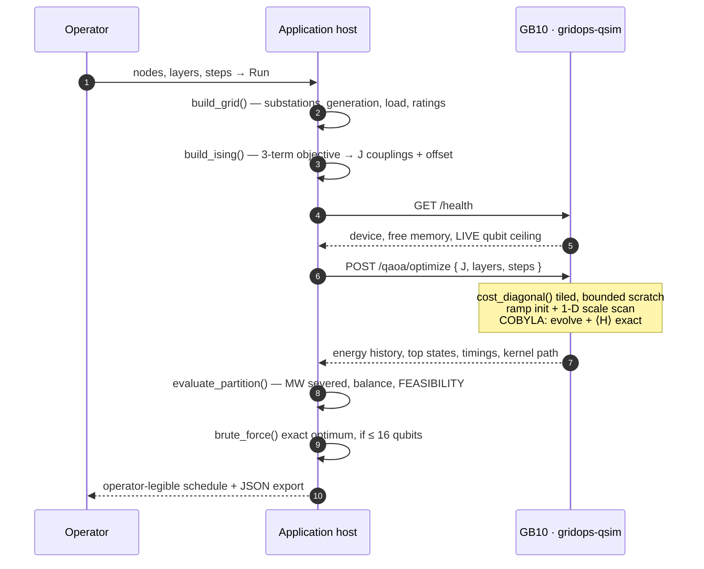

# Architecture

Two machines, one HTTP hop, and a hard rule about which one is allowed to hold the
quantum state. This page covers both the hardware it runs on and the software that runs
on it — including the constraints and the forced decisions, because a diagram that
implies everything was a free choice is the fastest way to lose a technical reader.

## The system at a glance

**No quantum state crosses that line.** The host sends coupling constants and receives
energies. The state vector — 2ⁿ complex amplitudes, 16 GB at 30 qubits — is allocated on
the GB10, lives in GPU memory for the whole run, and is never serialized to the host.

!!! warning "The split is forced, not stylistic"
    **`qiskit-aer-gpu` publishes x86_64 wheels only.** There is no aarch64 build, so
    Qiskit's GPU simulator **cannot be installed on the GB10 at all**. cuQuantum *does*
    ship aarch64, so the GPU path on Grace Blackwell is CuPy plus cuStateVec.

    Running the simulation on the GB10 therefore *requires* separating it from a UI that
    runs elsewhere. This diagram is what the hardware permits, not a preference.

## The hardware

| | Dell Pro Max GB10 | Application host |
|---|---|---|
| Silicon | Grace Blackwell, sm_121 | x86_64 |
| Memory | **128 GB unified**, CPU+GPU coherent | ordinary system RAM |
| Role | the entire quantum simulation | UI, domain model, orchestration |
| GPU needed | yes — it *is* the product | none |
| Holds | the state vector | no quantum state at all |

**Unified memory is the whole reason a desktop-class machine appears here.** For
state-vector simulation the binding resource is not FLOPS and not total GPU memory across
a box — it is the largest *coherent* memory domain, because every gate touches the entire
state and the state cannot straddle a slow link. 128 GB coherent is what carries 30 qubits
of dense all-to-all QAOA. The [Hardware](hardware.md) page works that argument through
against the rest of the Dell line.

Two consequences that only show up on unified memory:

- **The qubit ceiling is live, not a constant.** It is computed from *free* memory at
  request time, because the GPU's memory is shared with everything else resident on the
  machine.
- **A neighbour lowers the ceiling.** Models resident through the GB10 orchestrator do
  not merely slow a run; they reduce the largest state that fits. Which is why the GPU
  is claimed rather than shared.

## GPU residency — claim and release

Same discipline as the lab's L4 fleet: a demo **claims** the GPU, gets the whole machine,
and **releases** it so the default inference tenant returns.

| `tools/gb10-gpu` | Effect |
|---|---|
| `claim` | record and unload resident orchestrator models → start `gridops-qsim`. **GB10-backed LiteLLM lanes are unavailable until released.** |
| `release` | stop `gridops-qsim` → restore exactly the recorded set |
| `status` | what is resident, memory in use, and the live qubit ceiling — non-mutating |

Both the CLI and the application's residency panel call one control plane,
`gridops-residency`, rather than driving the orchestrator themselves. One
serialized path, one durable record of what was resident, and a lease that
releases the machine automatically if a demo ends without anyone saying so.
The simulator is a **typed** service, not a model lane: the inference gateway
routes language models, and arbitration between the two is residency, not
request routing.

## The four software layers

**1 — Interface and orchestration.** Contingency parameters, topology visualization,
convergence telemetry, the exportable islanding schedule, and the domain model itself:
transmission topology, generation and load, and the QUBO construction. Holds **no quantum
state** — it sends couplings and receives energies.

**2 — Quantum formulation.** Three competing objectives reduced to a pure-quadratic Ising
Hamiltonian, dense all-to-all because the balance term couples every node to every other.
SciPy COBYLA tunes the (γ, β) schedule.

**3 — Hardware acceleration.** Dense state-vector evolution over 2ⁿ complex amplitudes as
CUDA kernels; the state lives in GPU memory and never returns to the host during a run.
Because the cost Hamiltonian is diagonal, the cost unitary is a single elementwise phase
multiply rather than thousands of RZZ gates, and ⟨H⟩ is computed **exactly**.

The QAOA mixer runs through **cuStateVec**, NVIDIA's purpose-built statevector kernels:
**4.0–4.2× measured** against the general-purpose CuPy path, agreeing to ~1e-18. The cost
unitary deliberately stays on the tiled CuPy path — routing it through cuStateVec measured
4.18× against 4.17× while requiring the full 2ⁿ phase array in device memory, 16 GB at 30
qubits. Mixer accelerated, diagonal tiled: full speed, full ceiling.

**4 — Dell infrastructure.** Entirely on-premise. Grid topology, generation profiles and
contingency plans never leave the building.

## Request path — one optimization

Step 9 is the one worth noticing: below 16 qubits the demo computes the **exact** answer
by brute force and shows QAOA's result against it — including the cases where QAOA loses.

## API surface

| Endpoint | Purpose |
|---|---|
| `GET /health` | device, free/total memory, **live** qubit ceiling — queried, never hard-coded |
| `GET /noise/ceiling` | clean and noisy ceilings from actual free memory |
| `POST /qaoa/optimize` | full run — convergence history, shortlist, timings, kernel path |
| `POST /qaoa/evaluate` | one timed energy evaluation |
| `POST /qaoa/realism` | the same circuit ideal / finite-shot / noisy |
| `POST /qaoa/verify` | proves the diagonal fast path ≡ gate-by-gate RZZ |

## Measured performance

Dense all-to-all QAOA, p=2, cuStateVec kernels, 2026-07-30:

| Qubits | State vector | Per energy evaluation |
|---|---|---|
| 24 | 0.25 GB | **0.16 s** |
| 26 | 1.0 GB | 0.65 s |
| 28 | 4.0 GB | 2.78 s |
| 30 | **16 GB** | 11.98 s — capability ceiling, not interactive |

Interactive work happens at 6–24 qubits. The 30-qubit figure exists to mark the wall, not
to be driven live in front of an audience.

## Honest reporting

The result always names the path that **actually executed**, never the one requested. A
local fallback labels itself `local-*` with an explicit warning naming what the result
does not support — because a run that silently executes elsewhere while the interface
reports GB10 hardware is exactly the unearned claim this project exists to avoid.

## Security posture

| | |
|---|---|
| Data egress | none — grid topology and contingency plans never leave the building |
| Inference dependency | none — this application makes no LLM or external API calls |
| Quantum dependency | none — no cloud QPU, no vendor queue |
| Hardware | TAA-compliant, air-gappable |
| Front door | identity-proxy with passkey authentication |

## What is not done

No systemd unit for the simulation service, so it does not survive a host reboot.
The objective has no thermal term (see [note 03](notes/03-what-a-qubo-cannot-express.md)).
Roughly 3× of theoretical memory-bandwidth headroom at 30 qubits is unexplained and would
need profiling to attribute.
